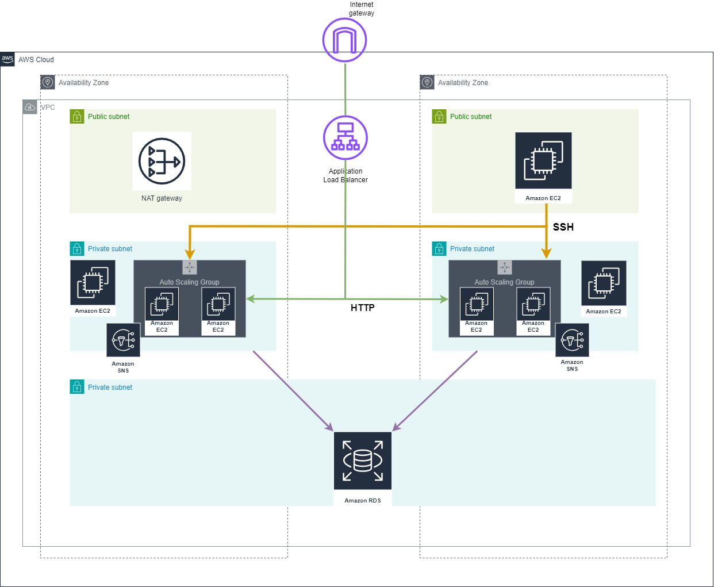

# AWS 3 Tier Architecture (AWS3TA)
Repository contains the terragrunt project of 3TA. 

### Project structure:

```
terragrunt.hcl
|
+---dev
|   |   env.hcl
|   \---eu-central-1
|       +---alb
|       |   \---terragrunt.hcl
|       |   
|       +---asg
|       |   \---terragrunt.hcl
|       |
|       +---ec2-bastion
|       |   \---terragrunt.hcl
|       |   
|       +---ec2-private
|       |   \---terragrunt.hcl
|       |
|       +---rds
|       |   \---terragrunt.hcl
|       |
|       \---vpc
|           \---terragrunt.hcl
\---master
    +---eu-central-1
    \---global
        +---iam-account
        \---organizations
```


Infrastructure was created using following modules from repository [TerragruntModules](https://github.com/Tomczi18/terragruntModules) :
* [Virtual Private Cloud VPC](https://github.com/Tomczi18/terragruntModules/tree/main/vpc)
* [Relational Database Service (RDS)](https://github.com/Tomczi18/terragruntModules/tree/main/rds-db)
* [Bastion Host (EC2)](https://github.com/Tomczi18/terragruntModules/tree/main/ec2-bastion)
* [Private EC2 instances](https://github.com/Tomczi18/terragruntModules/tree/main/ec2-private)
* [Auto Scaling Groups (ASG)](https://github.com/Tomczi18/terragruntModules/tree/main/asg)
* [Application Load Balancer (ALB)](https://github.com/Tomczi18/terragruntModules/tree/main/alb)

### AWS3TA Infrastructure Schema


